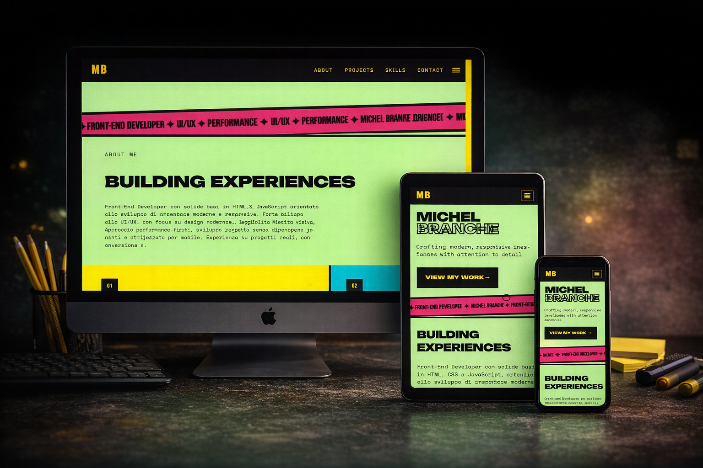

# ⚡ Michel Branche – Portfolio

> Brutalist-inspired front-end portfolio focused on identity, interaction, and performance.

---

## 🧠 Overview

This is my personal portfolio, designed and developed to reflect both my technical skills and my visual approach to web development.

The project combines:
- brutalist aesthetics
- modern UI patterns
- interactive elements
- performance-focused structure

It’s not just a showcase, but a **visual statement** of how I build and think.


## Preview



---

## 🎯 Goals

- Build a strong and recognizable visual identity  
- Showcase real projects in a clean and impactful way  
- Create a smooth and interactive user experience  
- Keep the project lightweight and fully controlled  
- Stand out from standard developer portfolios  

---

## 🎨 Design Approach

The design is heavily inspired by **brutalist and experimental web design**, mixed with modern UX principles.

Key ideas:
- High contrast  
- Bold typography  
- Minimal but intentional layout  
- Interactive feedback (cursor, scroll, transitions)  

Every section is designed to feel **alive and responsive**.

---

## ✨ Features

- Custom brutalist UI system  
- Smooth navigation between sections  
- Scroll-based interactions  
- Dynamic content rendering (via `data.js`)  
- Custom cursor and visual effects  
- Fully responsive layout  

---

## 🛠️ Tech Stack

- HTML5  
- CSS3 (custom styling, no frameworks)  
- JavaScript (Vanilla)  

---

## 📂 Project Structure

```bash
/
├── index.html
├── style.css
├── script.js
├── data.js
├── assets/
│   ├── images
│   └── mockups
```

---

## 🚀 Live

👉 https://michelbranche.github.io/portfolio

---

## 🧠 Philosophy

This portfolio is built around a simple idea:

> A developer is not just code, but also taste.

I focus on:
- clean structure  
- visual impact  
- user perception  
- interaction details  

---

## 🔒 License

This project is licensed under a custom Non-Commercial License.

You are free to use, modify, and study the code for personal and educational purposes only.

Commercial use is strictly prohibited.

© 2026 Michel Branche

---

## 👤 Author

**Michel Branche**  
Frontend Developer & Creative  

- GitHub: https://github.com/MichelBranche  
- YouTube: https://www.youtube.com/@Zeropodcastreal  
- TikTok: https://www.tiktok.com/@zeropodcastofficial  
- Email: michel.lavoro@gmail.com
